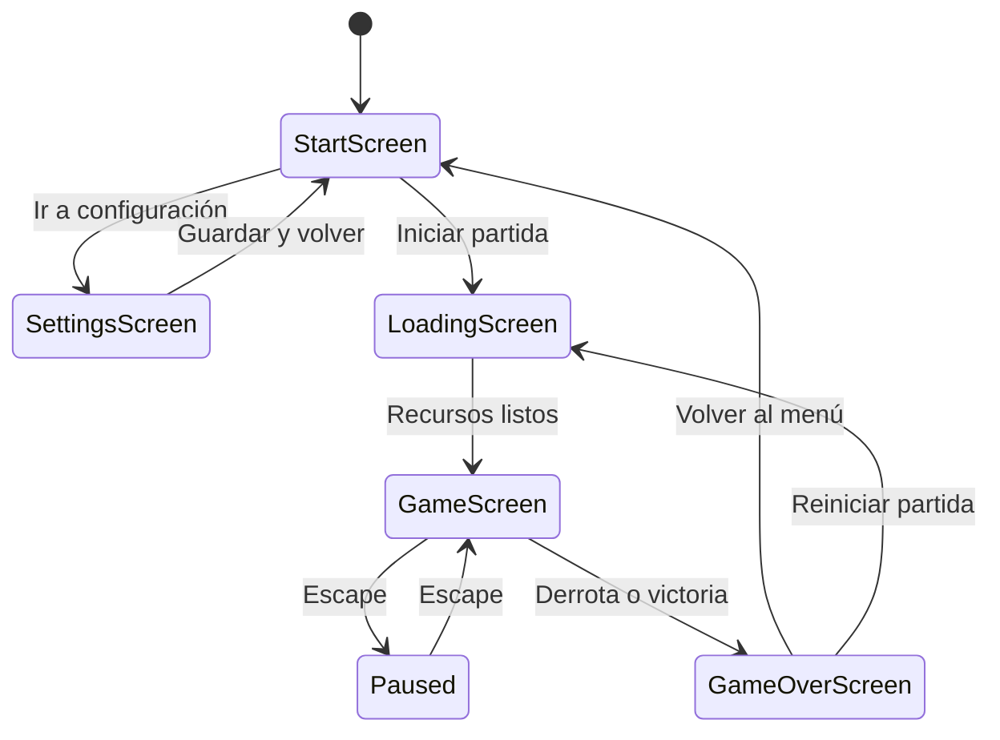
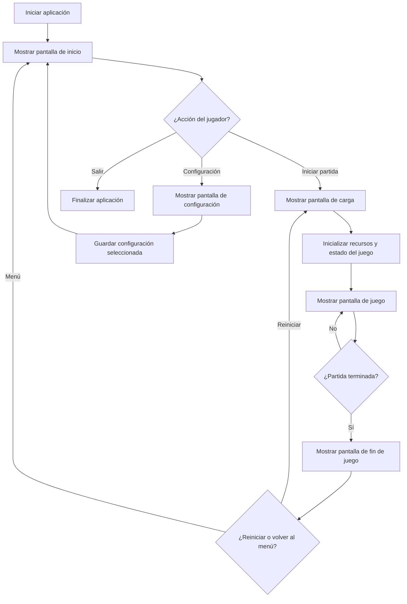
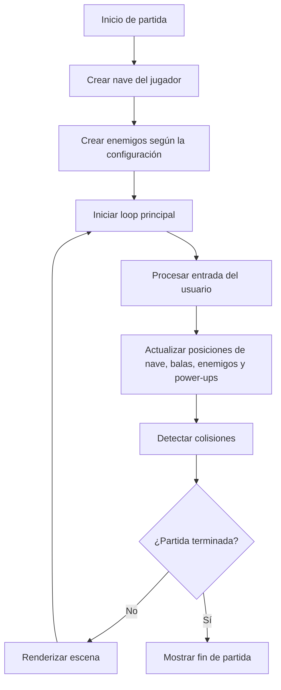
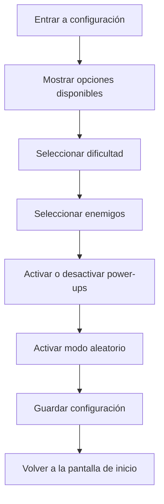

# Diseño - Space Invaders (Fase SDD: Design)

## 1. Propósito del diseño
Este documento define la arquitectura, la estructura de módulos, los componentes principales y el flujo de interacción del juego Space Invaders a implementar en Python con Pygame, basado en los requisitos funcionales y no funcionales definidos previamente.

## 2. Objetivos de diseño
- Definir una arquitectura sencilla y escalable para un MVP.
- Separar la lógica del juego de la interfaz y de los recursos.
- Facilitar futuras extensiones como efectos de sonido, niveles adicionales, mejoras de UI y puntuación.
- Asegurar que el juego cumpla con los requisitos de movimiento, disparos, vidas, puntuación, configuración y estados de juego.

## 3. Enfoque arquitectónico
Se utilizará una arquitectura modular tipo MVC-lite, organizada de forma simple para Pygame:
- Modelo: representa el estado del juego, la configuración, el jugador, los enemigos, las balas, los power-ups y las reglas de colisión.
- Vista: renderiza las pantallas, la interfaz, los elementos del escenario y los textos de estado.
- Controlador: gestiona entradas del teclado, transiciones entre pantallas, lógica del loop principal y cambios de estado.

## 4. Estructura propuesta del proyecto

```text
project/
├── main.py
├── config/
│   └── settings.py
├── core/
│   ├── game.py
│   ├── state.py
│   └── events.py
├── screens/
│   ├── start_screen.py
│   ├── loading_screen.py
│   ├── settings_screen.py
│   ├── game_screen.py
│   └── game_over_screen.py
├── entities/
│   ├── player.py
│   ├── enemy.py
│   ├── bullet.py
│   └── powerup.py
├── systems/
│   ├── collision.py
│   ├── input.py
│   ├── ui.py
│   └── difficulty.py
├── assets/
│   ├── images/
│   └── sounds/
└── README.md
```

## 5. Diseño de pantallas

### 5.1 Pantalla de inicio
Responsabilidades:
- Mostrar el nombre del juego.
- Solicitar el nombre del jugador.
- Permitir iniciar partida.
- Permitir acceder a la configuración.
- Mostrar un mensaje de error si el nombre queda vacío y se aplica el valor por defecto.

Elementos visuales:
- Título del juego.
- Campo de texto para nombre del jugador.
- Botón de iniciar.
- Botón de configuración.

### 5.2 Pantalla de carga
Responsabilidades:
- Mostrar un mensaje de carga.
- Inicializar recursos y preparar la partida.
- Transicionar a la pantalla de juego.

### 5.3 Pantalla de configuración
Responsabilidades:
- Permitir elegir dificultad.
- Permitir seleccionar uno o varios enemigos.
- Permitir activar power-ups.
- Permitir activar una opción de configuración aleatoria.
- Guardar la configuración seleccionada para la partida.

Opciones de configuración:
- Dificultad: Fácil, Media, Difícil.
- Enemigos: selección individual o múltiple.
- Power-ups: habilitar/deshabilitar.
- Random: activar una configuración aleatoria.

### 5.4 Pantalla de juego
Responsabilidades:
- Renderizar la nave, los enemigos, las balas, los power-ups y los elementos del escenario.
- Ejecutar el loop principal del juego.
- Procesar movimiento, disparos y colisiones.
- Mostrar vidas, puntuación, estado de pausa y estado de victoria/derrota.

### 5.5 Pantalla de fin de juego
Responsabilidades:
- Mostrar el resultado final.
- Mostrar la puntuación obtenida.
- Permitir reiniciar la partida o volver al menú principal.

## 6. Diseño de entidades

### 6.1 Player
Atributos:
- x, y
- width, height
- speed
- lives
- is_alive
- shot_cooldown
- is_double_shot

Métodos:
- move(left/right)
- shoot()
- take_damage()
- reset()
- activate_double_shot()

### 6.2 Enemy
Atributos:
- x, y
- width, height
- speed
- health
- type
- direction
- is_alive

Métodos:
- move()
- descend()
- take_damage()
- update()

### 6.3 Bullet
Atributos:
- x, y
- speed
- direction
- damage
- active

Métodos:
- move()
- check_off_screen()

### 6.4 PowerUp
Atributos:
- x, y
- type
- active
- duration

Métodos:
- move()
- apply_effect(player)

## 7. Diseño de datos

### 7.1 Configuración del juego
Se almacenará en un objeto de configuración con los siguientes campos:

```python
class GameConfig:
    player_name: str
    difficulty: str
    selected_enemies: list[str]
    enable_powerups: bool
    random_mode: bool
    initial_lives: int = 3
    player_speed: int
    enemy_speed: float
    bullet_speed: int
    score_per_enemy: int = 100
```

### 7.2 Estado del juego
Se representará mediante un estado central que controle el flujo actual:

```python
class GameState:
    current_screen: str
    score: int
    lives: int
    game_over: bool
    paused: bool
    victory: bool
```

### 7.3 Reglas de juego concretas
- El jugador inicia con 3 vidas.
- La dificultad define los valores de velocidad y frecuencia de aparición de enemigos.
- Un enemigo destruido suma 100 puntos.
- Un power-up de disparo doble dura un tiempo corto y se activa solo si está habilitado en la configuración.
- Si un enemigo alcanza la parte inferior de la pantalla o toca la nave, se reduce una vida.
- Si las vidas llegan a cero, la partida termina en derrota.
- Si todos los enemigos son eliminados, la partida termina en victoria.

## 8. Estados del juego



## 9. Flujo de juego

### 9.1 Inicio
1. Se inicia la aplicación.
2. Se muestra la pantalla de inicio.
3. El jugador ingresa su nombre.
4. El jugador puede ir a configuración o iniciar partida.

### 9.2 Configuración
1. El usuario selecciona dificultad.
2. El usuario elige enemigos.
3. El usuario decide si habilita power-ups y modo aleatorio.
4. Se guarda la configuración.

### 9.3 Carga
1. Se muestra la pantalla de carga.
2. Se inicializan recursos y objetos del juego.
3. Se transiciona a la pantalla de juego.

### 9.4 Partida
1. Se crea la nave del jugador.
2. Se crean los enemigos según la configuración.
3. El jugador puede moverse con las flechas.
4. El jugador puede disparar con espacio.
5. Se verifican colisiones entre balas y enemigos.
6. Se verifican colisiones entre enemigos y nave.
7. Se actualiza la puntuación y se revisa si la partida termina.

## 10. Diseño del loop principal
El juego correrá en un loop principal de Pygame con las siguientes fases:
1. Manejo de eventos.
2. Actualización del estado.
3. Detección de colisiones.
4. Renderizado de la escena.
5. Control de FPS.

```python
while running:
    handle_events()
    update_game()
    check_collisions()
    render()
```

## 11. Diseño de control de entrada
- Flechas izquierda/derecha: mover la nave.
- Espacio: disparar.
- Escape: pausar o reanudar la partida.
- Enter: confirmar selección en pantallas de UI.

## 12. Diseño de colisiones
Se implementará un sistema simple de colisión por rectángulos:
- Bullet vs Enemy
- Enemy vs Player
- Bullet vs PowerUp

Reglas:
- Si una bala impacta a un enemigo, este desaparece o recibe daño.
- Si un enemigo toca a la nave, se pierde una vida.
- Si las vidas llegan a cero, la partida termina en derrota.
- Si todos los enemigos desaparecen, la partida termina en victoria.

## 13. Diseño de UI
La interfaz se construirá con Pygame y componentes básicos de texto y botones.
- Se usará texto para títulos, opciones y estados.
- Los botones podrán ser rectángulos con texto.
- Se mantendrá una estética simple para el MVP.

## 14. Consideraciones de implementación
- Se usará una estructura clara de clases para facilitar mantenimiento.
- Los recursos gráficos y de sonido se cargarán desde la carpeta assets.
- El diseño debe ser suficiente para un MVP funcional.
- El código debe estar preparado para ser extendido en futuras iteraciones.

## 15. Diagramas de flujo

### 15.1 Diagrama de flujo general del juego


### 15.2 Diagrama de flujo de la partida


### 15.3 Diagrama de flujo de configuración


## 16. Criterios de aceptación del diseño
- El diseño debe permitir implementar la pantalla de inicio, configuración, carga, juego, pausa y fin de partida.
- El diseño debe contemplar el movimiento de la nave, disparos, vidas, puntuación y colisiones.
- El diseño debe soportar la selección de dificultad, enemigos y power-ups.
- El diseño debe facilitar la transición entre pantallas y estados del juego.

## 17. Propuesta de implementación MVP
Para la primera versión del juego se implementarán:
- Pantalla de inicio
- Pantalla de carga
- Pantalla de configuración básica
- Nave controlada por teclado
- Disparos
- Enemigos con movimiento descendente
- Sistema de vidas
- Sistema de puntuación
- Dificultad simple
- Selección de enemigos
- Power-up de disparo doble
- Pausa y reinicio de partida
